# UnitAPI: Universal Hardware Interface as Network Devices

## Overview

UnitAPI (Unit Hardware API) is a comprehensive Python framework for managing and interacting with network-connected hardware devices across different platforms and protocols. It provides a unified, flexible, and secure approach to device communication and control.

## Key Features

### 1. Device Management
- Automatic device discovery
- Dynamic device registration
- Multi-protocol support
- Flexible device abstraction

### 2. Communication Protocols
- WebSocket
- MQTT
- Custom protocol extensions

### 3. Security
- Token-based authentication
- Encryption
- Access control
- Audit logging

### 4. Device Types
- Cameras
- Microphones
- Speakers
- GPIO Controllers
- Custom device implementations

## Architecture

### High-Level Architecture

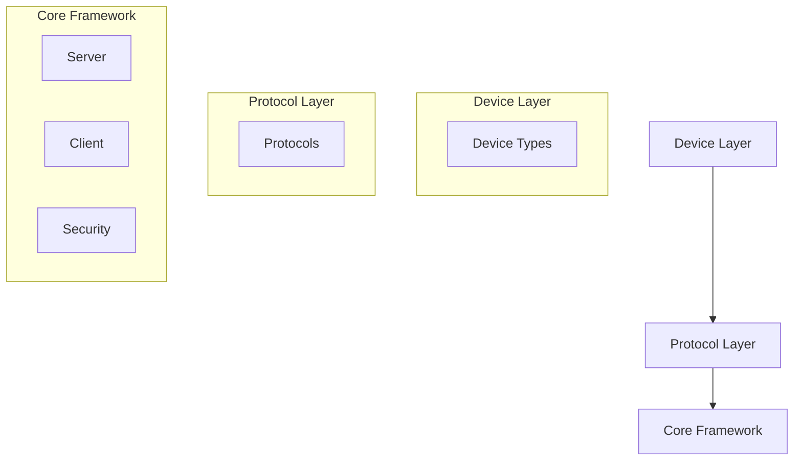

### Component Diagram

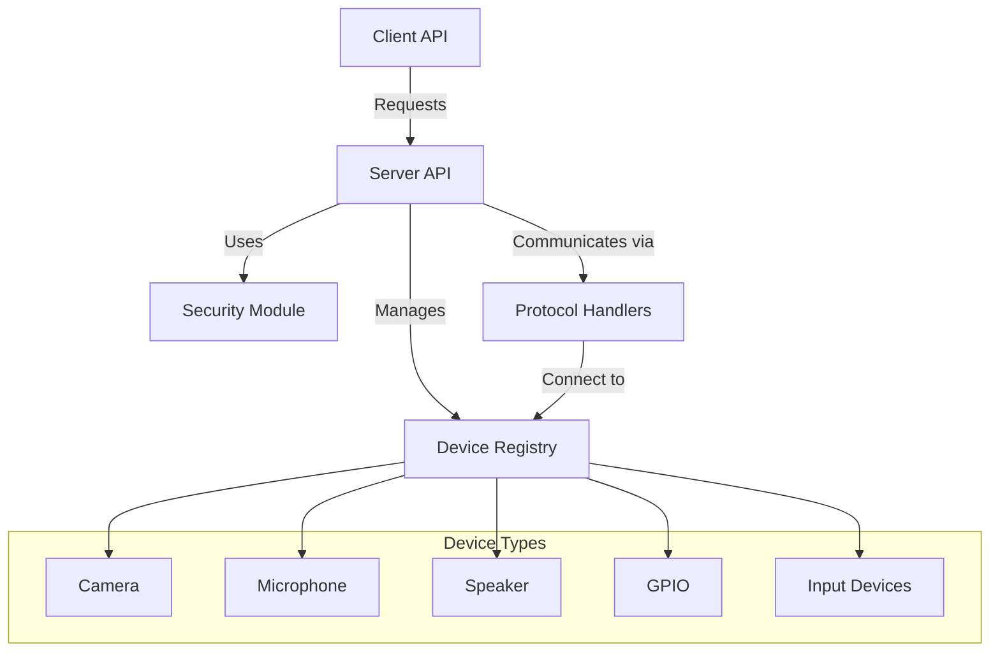

### Device Inheritance Structure

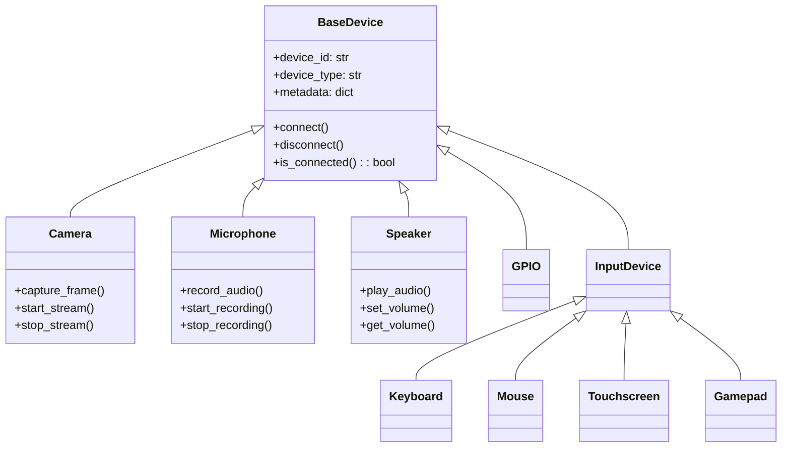

### Communication Sequence

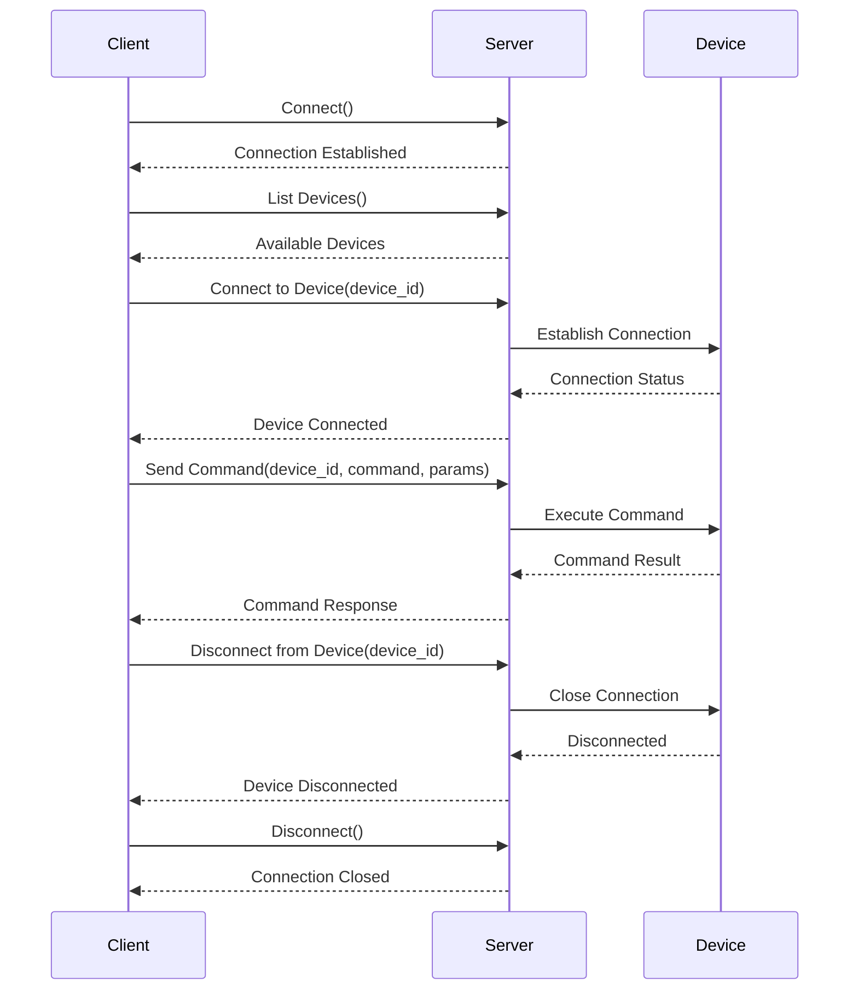

### Device Discovery Process

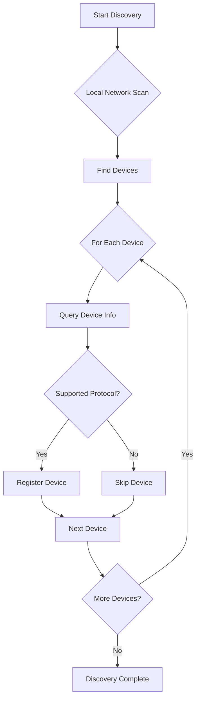

### Device Connection Lifecycle

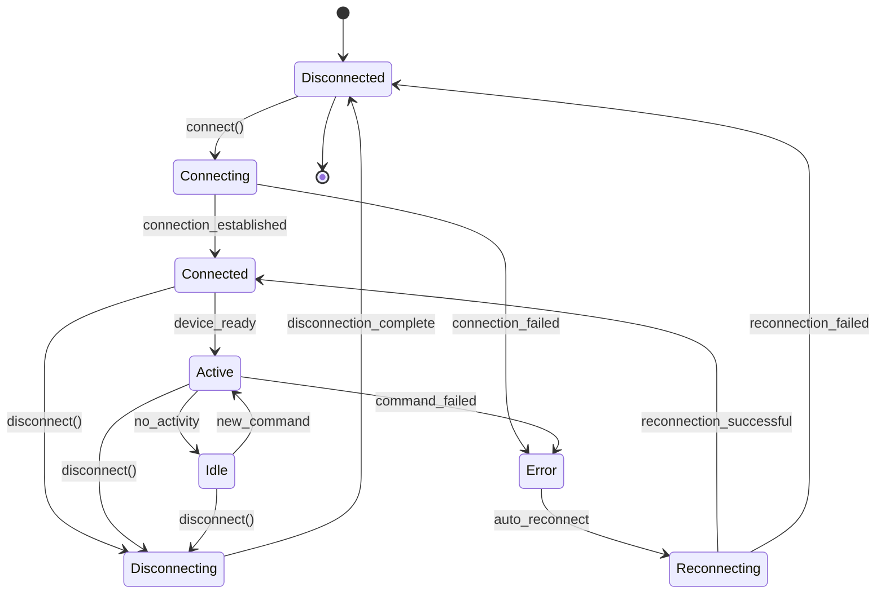

### Deployment Architecture

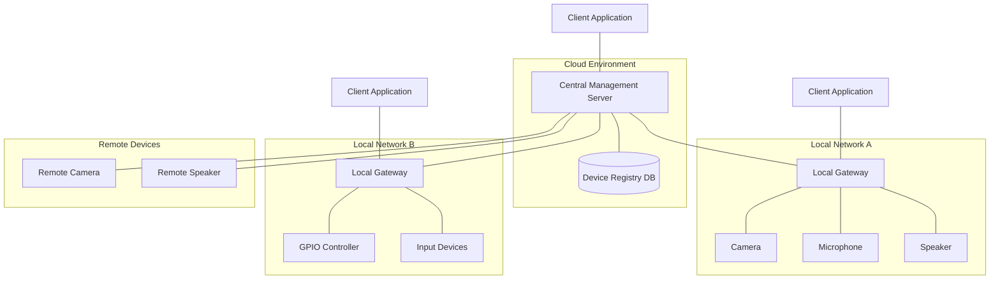

### Network Topology

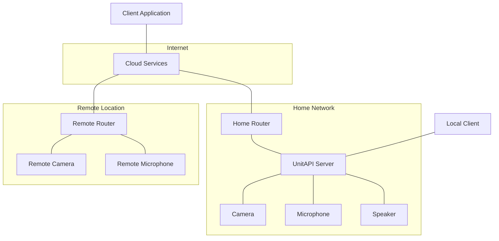

### Implementation Timeline

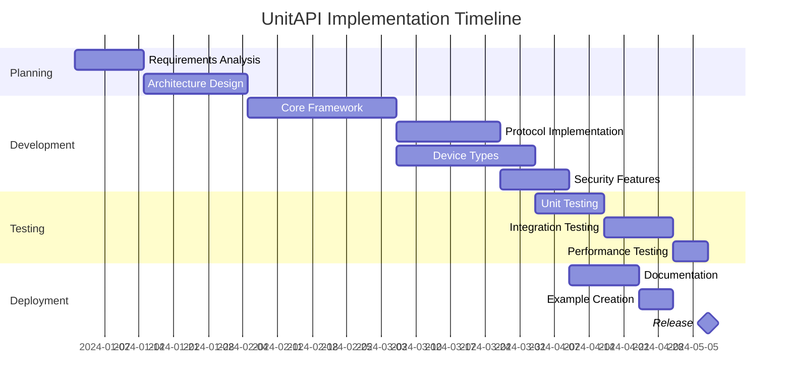

### Device Type Distribution

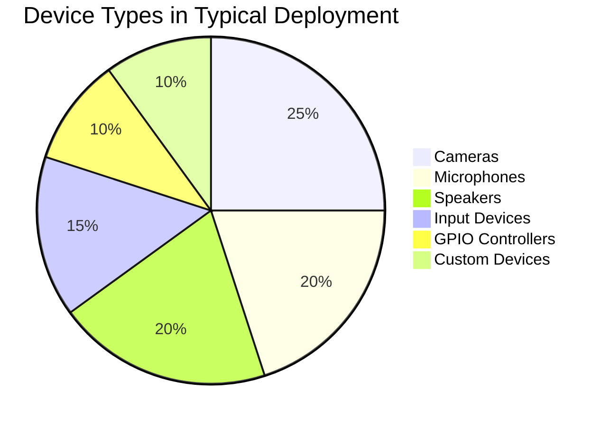

### User Experience Journey

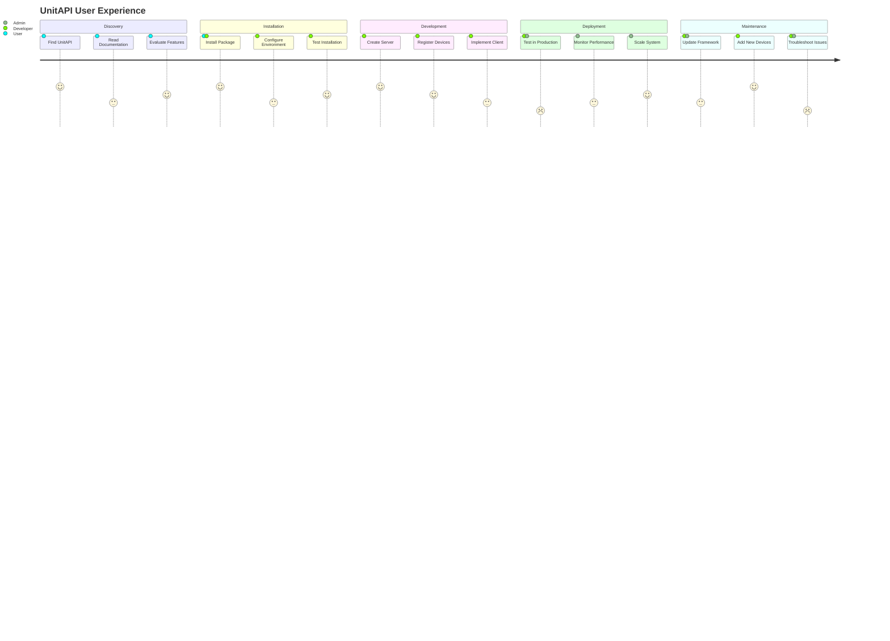

## Quick Start

### Installation

```bash
pip install unitapi
```

#### Optional Protocol Support
```bash
# Install with specific protocol support
pip install unitapi[mqtt]
pip install unitapi[websocket]
```

### Basic Usage

#### Server Setup
```python
from unitapi.core.server import UnitAPIServer

# Create a server instance
server = UnitAPIServer(host='0.0.0.0', port=7890)

# Register a device
server.register_device(
    device_id='temp_sensor_01', 
    device_type='sensor',
    metadata={
        'location': 'living_room',
        'capabilities': ['temperature', 'humidity']
    }
)

# Start the server
server.start()
```

#### Client Interaction
```python
from unitapi.core.client import UnitAPIClient

# Create a client
client = UnitAPIClient(server_host='localhost', server_port=7890)

# List available devices
devices = client.list_devices()
print("Available Devices:", devices)
```

## Core Concepts

### 1. Devices
- Represent physical or virtual network-connected devices
- Provide a consistent interface for interaction
- Support custom device type creation

### 2. Protocols
- Abstraction layer for different communication methods
- Easy integration of new protocols
- Seamless device communication

### 3. Security
- Comprehensive authentication mechanisms
- Fine-grained access control
- Encryption of device communications

## Use Cases

- Smart Home Automation
- Industrial IoT
- Remote Monitoring
- Network Device Management
- Distributed Sensor Networks
- Remote Audio Control

## Documentation Sections

1. [Installation Guide](installation.md)
2. [Usage Guide](usage.md)
3. [Device Types](device_types.md)
4. [Protocols](protocols.md)
5. [Security](security.md)
6. [Examples](examples.md)
7. [Remote Speaker Agent](remote_speaker_agent.md)

## Contributing

We welcome contributions! Please read our [Contribution Guidelines](CONTRIBUTING.md) for details on how to get started.

## Support

- GitHub Issues: [UnitAPI Issues](https://github.com/UnitApi/python/issues)
- Email: support@unitapi.com

## License

UnitAPI is open-source software licensed under the MIT License.

## Version

Current Version: 0.1.5

## Compatibility

- Python 3.8+
- Supported Platforms:
  - Windows 10/11
  - macOS 10.15+
  - Linux (Ubuntu 20.04+, Debian 10+)
  - Raspberry Pi (Raspbian/Raspberry Pi OS)

## Performance Characteristics

- Low-latency device communication
- Minimal overhead
- Scalable architecture
- Async-first design

## Roadmap

### Upcoming Features
- Enhanced machine learning integration
- More device type support
- Advanced discovery mechanisms
- Cloud service integrations
- Improved remote device management

## Disclaimer

UnitAPI is an evolving project. While we strive for stability, 
the API may change in future versions.

## Acknowledgments

Thanks to all contributors and the open-source community 
for making this project possible.
